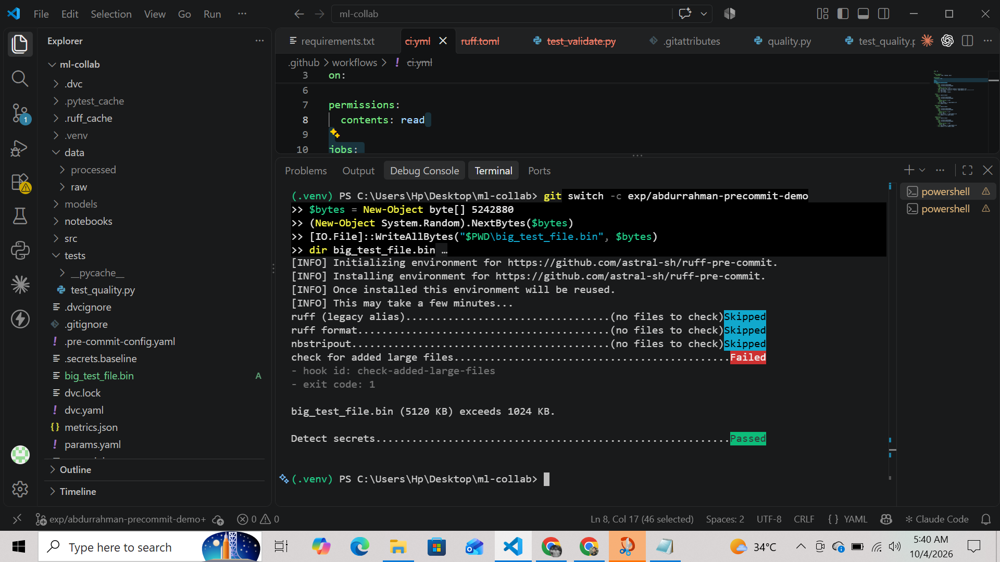
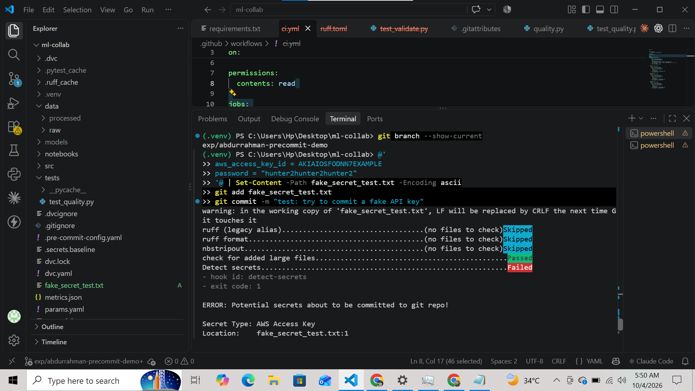
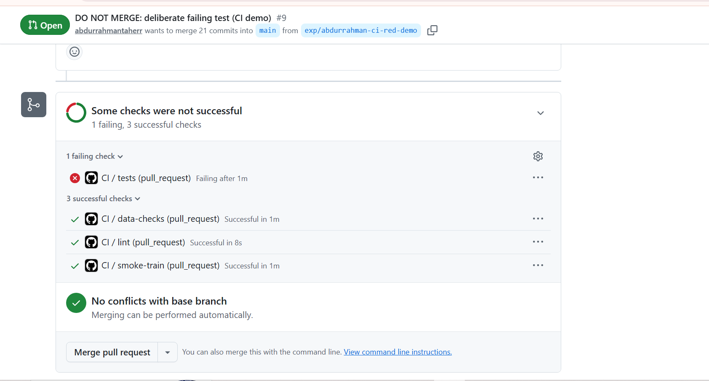
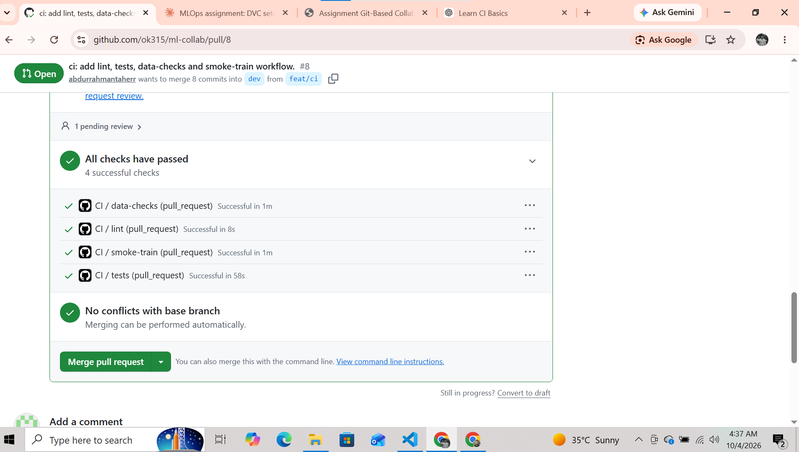

# REPORT: Telco Customer Churn, Git and DVC collaboration

## 1. Team, roles, dataset, starter code
- Abdurrahman: Model owner (training pipeline, configs, experiments)
- Osama: Data owner, and Platform owner (split between us in a team of two)
- Dataset: Telco Customer Churn (Kaggle)
- Starter code source: The initial project structure and configuration were created by the team for this assignment. No external starter repository was used. We used official documentation for tools such as Python, scikit-learn, DVC, and GitHub Actions where needed.

## 2. Reproducibility table (released model)

| Item | Value |
|---|---|
| Commit SHA | `ffb0ff25ccbed18bb51a726f1eb4245ff0985815` |
| params.yaml values | `random_state=42, test_size=0.2, algorithm=random_forest, n_estimators=100, max_depth=6, class_weight=balanced` |
| Data .dvc md5 | `3b0bfab28a8101b4e4fdd08025a5c235` |
| dvc.lock | `dvc.lock` |
| Seed | `42` |
| Final metrics | `accuracy=0.7466, precision=0.5147, recall=0.7968, f1=0.6254, roc_auc=0.84` |

## 3. Experiments
Selection rule: highest ROC-AUC, F1 as tie-breaker. Runs used a fixed seed and split.
AbdulRahmanTahir's experiments:
| Experiment | max_depth | n_estimators | accuracy | precision | recall | f1 | roc_auc |
|---|---|---|---|---|---|---|---|
| baseline | 10 | 100 | 0.7537 | 0.5254 | 0.7460 | 0.6166 | 0.8376 |
| depth-4 | 4 | 100 | 0.7289 | 0.4933 | 0.7834 | 0.6054 | 0.8350 |
| depth-6 (winner) | 6 | 100 | 0.7466 | 0.5147 | 0.7968 | 0.6254 | 0.8400 |
| depth-14 | 14 | 100 | 0.7587 | 0.5360 | 0.6765 | 0.5981 | 0.8266 |

Why depth-6: best ROC-AUC, F1 and recall, with a consistent trend across the sweep. The
ROC-AUC gain (+0.0024) is small and within noise, so this is a judgment call.
Depth-14 was abandoned because it overfits (see section 4).
### Osama's Experiments

| Experiment | max_depth | n_estimators | accuracy | precision | recall | f1 | roc_auc |
|---|---:|---:|---:|---:|---:|---:|---:|
| osama-depth-4 | 4 | 100 | 0.7289 | 0.4933 | 0.7834 | 0.6054 | 0.8350 |
| osama-depth-8 (winner) | 8 | 100 | 0.7516 | 0.5214 | 0.7807 | 0.6253 | 0.8407 |
| osama-depth-12 | 12 | 100 | 0.7559 | 0.5299 | 0.7112 | 0.6073 | 0.8300 |

Why `osama-depth-8`: it achieved the highest ROC-AUC (`0.8407`) among Osama's three experiments while also maintaining a strong F1 score (`0.6253`) and high recall (`0.7807`). Although `osama-depth-12` achieved slightly higher accuracy, its ROC-AUC, recall, and F1 were lower, so `max_depth=8` was selected as the better-balanced experiment.

## 4. Links
- Data-update PR: https://github.com/ok315/ml-collab/pull/16
- Conflict-resolution PR: https://github.com/ok315/ml-collab/pull/15#pullrequestreview-5407615382
- A "changes requested" review: ## Conflict Resolution

To demonstrate a real Git conflict, both team members created separate branches from `dev` and intentionally edited the same line in `params.yaml`.

Abdurrahman worked on `feat/abdurrahman-conflict` and changed:

`# Model configuration`

to:

`# Model configuration - updated by Abdurrahman`

Osama worked separately on `feat/osama-conflict` and changed the same line to:

`# Model configuration - updated by Osama`

Abdurrahman's pull request was merged into `dev` first. After that, Osama updated his branch by fetching the latest remote changes and rebasing onto `origin/dev`:

`git fetch origin`

`git rebase origin/dev`

Because both branches had changed the same line differently, Git produced a real content conflict in `params.yaml`:

`CONFLICT (content): Merge conflict in params.yaml`

The conflicted file contained both versions with Git conflict markers. Osama manually resolved the conflict by removing the conflict markers and replacing both versions with a single agreed line:

`# Model configuration - conflict resolved by Osama and Abdurrahman`

The resolved file was then staged and the rebase was continued using:

`git add params.yaml`

`git -c core.editor=true rebase --continue`

Because rebasing rewrote the feature branch history, the updated branch was pushed safely using:

`git push --force-with-lease origin feat/osama-conflict`

Finally, Osama opened a pull request from `feat/osama-conflict` into `dev`, documented the conflict-resolution process in the PR description, and Abdurrahman reviewed and merged the PR.

This completed the assignment requirement of creating a real conflict on the same line of `params.yaml`, merging one branch first, rebasing the second branch onto `dev`, manually resolving the conflict, and documenting the resolution.
- Release PRs (dev to staging, staging to main): TODO
- Abandoned exp/ branch: https://github.com/ok315/ml-collab/tree/exp/abdurrahman-tuning

## 5. Screenshots

### Blocked large file

### Blocked secret

### Failing CI check

### Passing CI check

## 6. Retrospective
What broke:
- Windows blocked venv activation; some work started on the wrong branch
- Dependencies were installed into the global Python before using a venv
- Plain dvc exp run kept params from the previous run, so one run changed two things
- dvc.lock recorded CRLF hashes from Windows; Linux would hash them differently
- ruff.toml was not committed, which would have failed CI
- Some pushes reached dev and main before branch protection was on
What we added to CONTRIBUTING.md because of it: TODO

## 7. Contributions

### Abdurrahman

- Built the DVC pipeline for data preparation, model training, and evaluation, including seeded stratified splitting and reproducible metrics (PR #1).
- Performed Random Forest hyperparameter experimentation and selected `max_depth=6` based on ROC-AUC, F1, and recall (PR #2).
- Added setup and pipeline execution instructions to the README (PR #3).
- Added the exploratory data analysis notebook and supporting missing-value summary functionality (PR #4).
- Built the CI workflow covering linting, unit tests, dataset validation, and smoke training (PR #8).
- Created a deliberate failing-CI demonstration to verify that CI catches test failures (PR #9).
- Fixed cross-platform line-ending issues affecting DVC pipeline outputs and refreshed the reproducibility files (PRs #10 and #11).
- Improved repository hygiene, including the pull-request review checklist/template (PR #12).
- Prepared the reproducibility report and added CI/repository screenshots documenting the workflow and checks (PR #13, in progress).
### Osama

- Set up the initial project structure and configuration, including the base package layout, `params.yaml`, dependencies, validation module, and project README.
- Added DVC dataset tracking for the Telco Customer Churn dataset, including the DVC configuration and dataset pointer.
- Added pre-commit quality and security controls, including Ruff linting/formatting, notebook handling, large-file checks, and secret detection (PR #6).
- Added and documented the team's contribution workflow, including branch conventions, PR review requirements, Conventional Commits, squash merging, and pre-commit usage (PR #7).
- Maintained and refined the project README and project title documentation.
- Added the contribution retrospective documenting issues encountered and the improvements made to the workflow.

